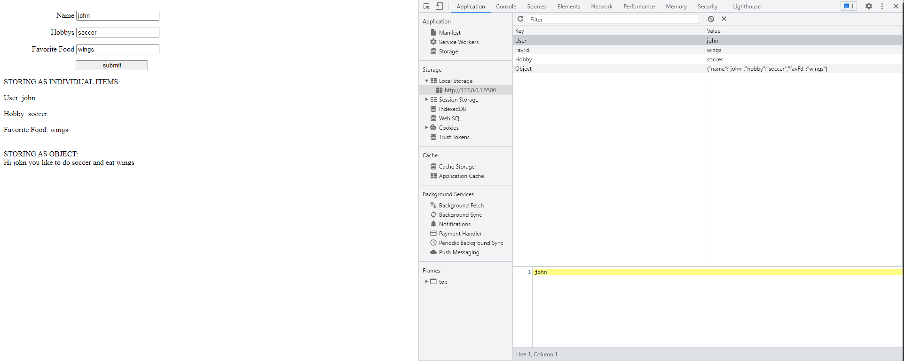

# Local Storage, A Genius Way to Store Local Data #
## Introduction ##  
Local Storage was the one of the great features introduced to modern browsers when HTML 5 came out. Unlike session storage, local storage does not get erased even if the browser is later closed. To compare it to something more relatable, Local Storage is in a way a cousin to browser cookies. Unlike Local Storage, cookies operate on the server-side and have an expiration date (usually when the browser is closed unless otherwise specified). The advantages of using Local Storage truly shine when the client data is the focus of the website. Not only does it not expire but browsers allocate around 5MB for Local Storage compared to the 4kb allocated for cookies. In this tutorial, we'll discuss the benefits of using local storage as well as how to use it to store data on your website.

## Tutorial ## 
### Getting Started ###
&ensp;&ensp;&ensp;To begin, you'll need to have a coding environment. Visual Studio Code is my go-to but really any code environment where you can manipulate HTML and JavaScript files will do.  

&ensp;&ensp;&ensp;Next, you'll need to find a way to run your code. I use the [Live Server Extension](https://marketplace.visualstudio.com/items?itemName=ritwickdey.LiveServer) to see my code live. You can also just open up the index.html file with file explorer(Windows) or Finder(Mac) to see your progress.  

&ensp;&ensp;&ensp;Before we start using Local Storage we need to understand some basics on how it actually works. Local Storage is a way for programmers to store user data in a way that is easily accessible and easy to manipulate. Local Storage uses key value pairs in the form of strings to store information. A key value pair usually looks something like this: 

`"Vegetables" : "Carrots"`  

&ensp;&ensp;&ensp;In this example Vegetables is the key and Carrots is the value. As mentioned before, Local Storage can hold up to 5MB of data so we could use multiple key value pairs in our storage. You might be thinking that only storing strings is a limited way to store things. Luckily JavaScript has a way that we can store objects in Local Storage using a notation called JSON (JavaScript Object Notation). By using JSON we can "stringify" objects and then store them in Local Storage. So, in this example, I could add peas, potatoes, cucumbers, etc. to the key Vegetables by using JSON. Without JSON, you would only be able to add one string to each key. I'll explain this later in the tutorial so just know for now that Local Storage is able to accept a wide range of data by incorporating JSON.

### Using Local Storage ###

&ensp;&ensp;&ensp;To begin using local storage, we'll need to create a HTML File with some basic elements that we can manipulate. Follow along with this tutorial [here](https://github.com/Benni371/Blog-Tutorial.git) and then copy the contents of the index.html file into your file in your coding environment. After that setup is done, we can focus on manipulating Local storage. In order to manipulate Local Storage, we'll need to create a new file called `script.js` the link to this file is already in the `index.html` so you won’t have to worry about that part. Now that we have created the script file, we can do some simple Local Storage manipulation. There are 2 steps when it comes to doing simple Local Storage manipulation: `localStorage.setItem()` and `localStorage.getItem()`. With these two functions, we can now learn how local storage is works. I have given IDs to the input tags in `index.html` so that we can use them in `script.js`.   
```js
    let name = document.getElementById("name")
    let hobby = document.getElementById("hobby")
    let favFd = document.getElementById("favFd")
    //set the data for the user
    localStorage.setItem("User", name.value)
    localStorage.setItem("Hobby", hobby.value)
    localStorage.setItem("FavFd", favFd.value)

    //get the data from the user and display on index.html
    document.getElementById("userInfo").innerHTML = "<p>User: " + localStorage.getItem("User") + "</p>" + "<p>Hobby: " + localStorage.getItem("Hobby") + "</p>" +"<p>Favorite Food: " + localStorage.getItem("FavFd") + "</p>"

```
&ensp;&ensp;&ensp;In the first part of the code block I grab each element by its id. Then to store those values in Locale storage I used the `setItem()` method. In each instance that I use `setItem()` the first value is the unique key and the second is the value that the user entered for that field. Key fields **have** to be unique otherwise there will be errors. Now once I have set each of those values, I can retrieve them by using the `getItem()` method. In the next part of the code, I use inner HTML to display three different `<p>` tags that each contain the local storage values. With `getItem()`, you can only retrieve one item for each key so you don’t need to reference anything else besides the key. Go ahead and test the code and see if it displays!   
&ensp;&ensp;&ensp;Now once its working, refresh your page. To see if your info is getting saved, you will need to right click on the page then click the inspect option and then click on the applications tab. Once on the applications tab, click on the local storage tab on the left and select localhost. You should now see you keys and values appearing there even after you refresh the page! If that’s a little confusing, here is a help video that shows how to get to the application tab in the browser inspector:)

Awesome! Now you have stored data in local storage. This data will stay there until you either overwrite it or delete it. Now, onto bigger and better things. JSON Objects. They sound a little intimidating, but they are beyond useful and take local storage and its abilities to a whole new level. Before we tackle JSON Objects, we first need understands what they are and how they are stored. JSON Objects are just strings that are later parsed into a JavaScript object but for this tutorial I just call them JSON Objects. For us to store a JSON Object we need to know a little syntax. Since JSON is a string and JavaScript doesn’t care which type of quote we use, we mostly will use the `''` to encase the string. Back to the vegetable example. If we wanted to make a vegetable as a JSON Object we would do it like this:  
 ```js 
let myObj = '{"vegetable":"Carrot", "color":"orange", "size":"large"}'
 //then to acces it we use a the JSON.parse method which is built into JS
 let parsedObj = JSON.parse(myObj)
 //then using the . operator
 console.log(parsedObj.vegetable)
 //result "Carrot"

 ```  

  
### Storing and Retrieving JavaScript Objects ###
&ensp;&ensp;&ensp;But this all seems kind of repetitive and tedious to do, doesn’t it? Luckily the developers of JSON thought ahead and made a quick and easy way for us to convert regular JavaScript objects in to JSON objects. In conjunction with the `JSON.parse()` method the developers provided us with `JSON.stringify()` which essentially converts the JavaScript object into a string for us. The method for being able to use these values and store them in Local Storage is create the object, stringify the object, store in local storage. To retrieve is: use the `getItem()` method, parse the string, use the object. By using these two processes, we can effectively use JavaScript objects and store them in Local Storage.  This is what the process would look like for what we'll do in our tutorial:
```js
//store in Local Storage
let food = {vegetable:"Carrot", color:"orange", size:"large"}
let s = JSON.stringify(food)
localStorage.setItem("Food", s)

//to retrieve from storage
let retrieve = JSON.parse(localStorage.getItem("Food"))
//display on webpage
document.getElementById("p").innerText = retrieve

```  
&ensp;&ensp;&ensp;After looking at the code in `script.js` can you tell how they difference after you submit the inputs? At first glance you can't really tell just based on the HTML. But if we look at the browser inspector, we can a significant difference in how they are stored.  
  
&ensp;&ensp;&ensp;Here we can see that the object was stored in the Object Key and that it looks similar to a JS object. It’s just a string! The great thing about this method is that we can store multiple objects within one key. So basically, we are creating a very rudimentary database within the browser. By using a couple tricks which I will show next we will be able to store multiple objects and also retrieve them. This can be a little lengthy so look at the commented code in the tutorial. Feel free to uncomment it and see what it does (hint: in Visual Studio Code if you highlight the commented section then push ctrl + k then ctrl + u it will uncomment everything that is highlighted).
&ensp;&ensp;&ensp;If you look closely you'll see that we added an array in order to store the objects. The reason we have to do it this way is because the `setItem()` method can only accept one thing to set. So what we did was stuffed all the objects into the array so we could satisfy the parameters for the `setItem()` method. If we wanted to add or delete from local storage, we would have to get everything out from local storage and loop through the array and add or delete wherever we needed then store it back in. 

## Conclusion ##
Overall, local storage is amazing. It allows to store a lot of data with very few lines of code. Not only that it is easy to retrieve and use. Though, a word of caution, local storage should not be used to store confidential or sensitive data as it could be available to whoever starts up the browser. If storing sensitive data, stick to server-sided storage solutions and always remember to encrypt your data. I hope this tutorial helped you learn how important and useful local storage can be in your code. Good luck and keep hacking!

## Resources ##
https://www.youtube.com/watch?v=AUOzvFzdIk4 : this YouTube video is great for getting a visual idea of how local storage works when storing objects. The video is very to the point and explains things at a good pace

https://htmldog.com/guides/javascript/advanced/localstorage/ : this document details the very simple functions of local storage and can help with getting used to the syntax and other parts of Local Storage.  

https://www.w3schools.com/jsreF/prop_win_localstorage.asp : W3Schools always has good tutorials and try it yourself windows that can help you see how to use the items that you have stored in Local Storage.

https://stackoverflow.com/questions/5410820/how-can-i-show-all-the-localstorage-saved-variables  : One thing that you may want to do in the future in loop through the keys that you have created in your Local Storage. This questions gets answered in a very simple and understandable way that can help you accomplish that. 

https://stackoverflow.com/questions/24544861/how-to-create-a-multiple-values-for-a-single-key-using-local-storage/24544905 : this question helps run through the logic of using an array to store multiple objects. It’s one that I used to help clear up why I couldn’t store multiple values under one key.


